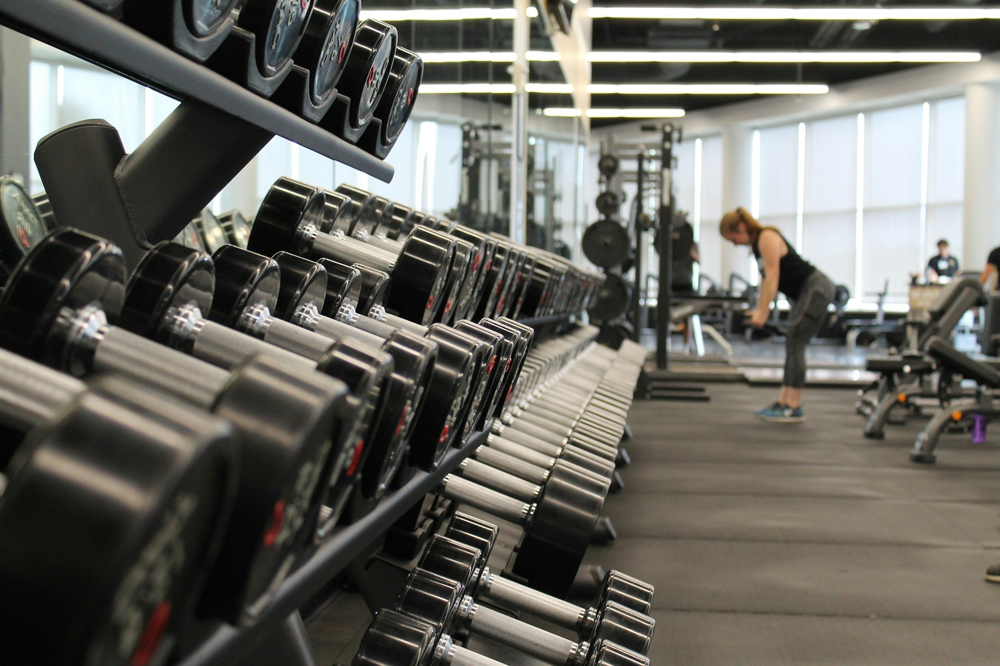

# BURNOUT - Modern Gym Website



A modern, responsive website for Burnout Gym featuring a sleek design, interactive elements, and smooth animations. Built with HTML, CSS, and JavaScript.

## 🌟 Features

- **Responsive Design**: Fully responsive layout that works on all devices
- **Modern UI/UX**: Clean and professional interface with smooth animations
- **Interactive Elements**: 
  - Dynamic navigation
  - Hover effects
  - Smooth scrolling
  - Image galleries
  - Contact form with validation
  
## 📱 Sections

1. **Home**
   - Hero section with dynamic background
   - Call-to-action buttons
   - Social media links

2. **Features**
   - Showcase of gym services
   - Interactive cards with hover effects
   - Service descriptions

3. **About**
   - Trainer profiles
   - Professional background
   - Expertise areas
   - Social connections

4. **Gallery**
   - Image showcase
   - Hover effects
   - Program descriptions
   - Interactive image grid

5. **Contact**
   - Contact form with validation
   - Professional imagery
   - Success notifications
   - Easy-to-use interface

## 🚀 Technologies Used

- HTML5
- CSS3 (with Custom Properties)
- JavaScript (ES6+)
- Web3Forms API
- Font Awesome Icons
- Google Fonts

## 💻 Setup and Installation

1. **Clone the repository**
   ```bash
   git clone https://github.com/yourusername/burnout-gym.git
   ```

2. **Navigate to the project directory**
   ```bash
   cd burnout-gym
   ```

3. **Open in browser**
   - Open `index.html` in your preferred browser
   - For development, use a local server (like Live Server in VS Code)

## 📋 Requirements

- Modern web browser (Chrome, Firefox, Safari, Edge)
- Internet connection (for fonts and icons)
- Minimum screen width: 320px

## 🎨 Customization

### Colors
The website uses CSS variables for easy customization:
```css
:root {
  --primary-color: #FF4B2B;
  --secondary-color: #2B2B2B;
  --accent-color: #00C9A7;
  --text-color: #333333;
  --light-text: #ffffff;
  --dark-bg: #1A1A1A;
}
```

### Fonts
- Primary Font: 'Exo 2'
- Headers: 'Montserrat'

## 📱 Responsive Breakpoints

- Mobile: 320px - 767px
- Tablet: 768px - 1023px
- Desktop: 1024px and above

## 🔧 Browser Support

- Chrome (latest)
- Firefox (latest)
- Safari (latest)
- Edge (latest)

## 📄 Contact Form Setup

1. Sign up at [Web3Forms](https://web3forms.com/)
2. Get your access key
3. Replace the access key in the contact form:
   ```html
   <input type="hidden" name="access_key" value="YOUR-ACCESS-KEY">
   ```

## 🤝 Contributing

1. Fork the repository
2. Create your feature branch
3. Commit your changes
4. Push to the branch
5. Open a pull request

## 📝 License

This project is licensed under the MIT License - see the LICENSE file for details.

## 👥 Credits

- Images: [Unsplash](https://unsplash.com)
- Icons: [Font Awesome](https://fontawesome.com)
- Fonts: [Google Fonts](https://fonts.google.com)

## 📞 Support

For support, email support@burnoutgym.com or create an issue in this repository.

---
Made with ❤️ by [Your Name] 